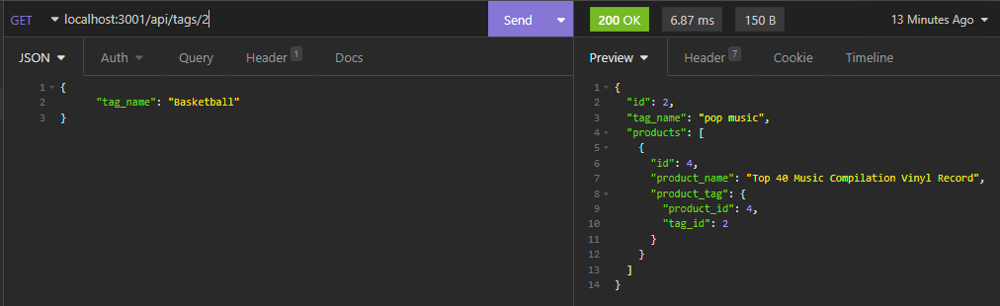

# E-Commerce-Back-End

  

  ## Description

  I wanted to see if I could build a application back end. The back end lets the user add, update, and delete a category, product, and tag. This really pushed me to learn many to many relationships in mysql.

  # Table of Contents
  1. [Description](#description)
  2. [Installation](#dnstallation)
  3. [Usage](#usage)
  4. [Contributing](#contributing)
  5. [Tests](#tests)
  6. [Questions](#questions)

  ## Installation

  Clone this git repo, Then open a terminal in the cloned repo folder. When you have that open type, ```npm i``` To get the dependencies. Then you can type, ```npm start``` This will start up a server for you to test or experiment with.

  ## Usage

  The current routes are,
  ```/api/categories```
  
  ```/api/products```

  ```/api/tags```
  You can get, post, put, and delete all three routes.

  ## Questions

  You can email me if you have any questions.

  You can send me any additional questions at my email nabhahnk@gmail.com.

  My [GitHub](https://github.com/nabhahnk)
